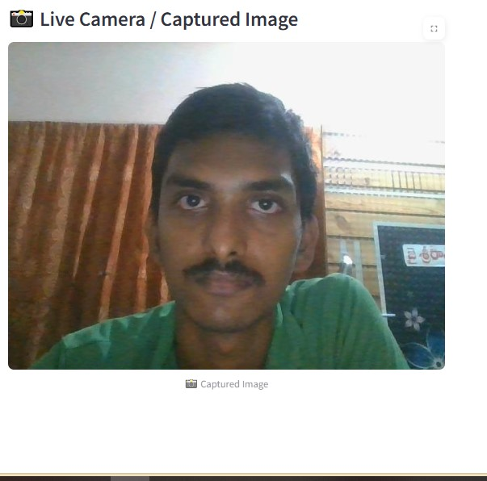
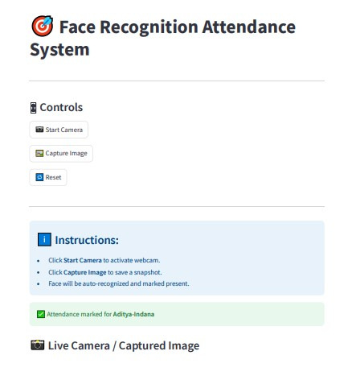
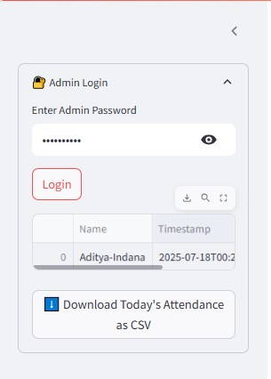

# Face-Recognition-Attendance-System-repository-iship
Here's a detailed step-by-step guide on how you can work on your Face Recognition Attendance System using AWS, covering daily activities, instructions, and sample code for each phase.

# 🎯 Face Recognition Attendance System

A smart attendance marking system built with **Streamlit** frontend and **AWS services** (S3, Rekognition, DynamoDB). This system captures a user’s face via webcam, compares it against known faces using Amazon Rekognition, and logs attendance in a DynamoDB table.

---

## 🚀 Features

- 📸 Live webcam capture
- ☁️ Upload captured images to AWS S3
- 🧠 Face recognition using AWS Rekognition
- 📝 Attendance logging in DynamoDB
- 🔐 Secure Admin Panel with password login
- ⬇️ Download daily attendance as CSV

---

## 🧱 Tech Stack

| Layer        | Tech                        |
|--------------|-----------------------------|
| Frontend     | Streamlit (Python)          |
| Backend      | Boto3 (AWS SDK for Python)  |
| Cloud Storage| Amazon S3                   |
| Recognition  | Amazon Rekognition          |
| Database     | Amazon DynamoDB             |
| Auth         | Basic password input        |

---

## 🗂️ Folder Structure

```

face-recognition-attendance/
├── app.py                     # Main Streamlit frontend
├── utils/
│   └── aws\_helper.py          # AWS helper functions
├── .env                       # Environment variables
├── requirements.txt           # Dependencies
├── known\_faces/               # Known face images (S3 upload)
├── output/
│   ├── screenshots/           # Captured screenshots
│   └── demo.mp4               # Demo video
└── README.md                  # This file

````

---

## ⚙️ Setup Instructions

### 🔐 1. Configure `.env`

```env
AWS_REGION=ap-south-1
AWS_ACCESS_KEY_ID=your-access-key
AWS_SECRET_ACCESS_KEY=your-secret-key
BUCKET_NAME=known-faces-of-students-2025
````

### 📦 2. Install Dependencies

```bash
pip install -r requirements.txt
```

### ▶️ 3. Run the App

```bash
python -m streamlit run app.py
```

---

## 👨‍💻 Admin Panel

* Visit `/` and enter the admin password.
* View attendance for the day.
* Download CSV.

---

## 📁 AWS Setup Required

* ✅ S3 Bucket (e.g., `known-faces-of-students-2025`)

  * `known_faces/` – upload known images like `Aditya.jpg`
  * `unknown/` – temporary uploaded images
* ✅ Rekognition has permission to read S3 bucket
* ✅ DynamoDB table named `AttendanceRecords` with schema:

  * Partition Key: `Name` (String)
  * Sort Key: `Timestamp` (String)

---

## 📸 Screenshots

| Interface       | Screenshot                                       |
| --------------- | ------------------------------------------------ |
| 👤 Face Capture |   |
| ✅ Match Success |  |
| 🔐 Admin Panel  |      |

> 📂 Save screenshots inside `output/screenshots/` folder

---

## 📽️ Demo Video

> Watch full system in action:

🎬 **Demo:** [](https://youtu.be/NtWbiVcd0cc)


---

## 🧠 Credits

Developed by **Indana Aditya**
🔗 [LinkedIn](https://www.linkedin.com/in/aditya-indana-899734216)
💻 GitHub: [22MH1A42G1](https://github.com/22MH1A42G1/)

Mentors: Mohammad Shaifu Zama, Durga Prasad Setti
Project by **Technical Hub, Aditya Engineering College**

---
